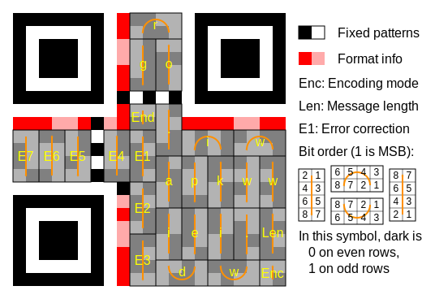

# Hadi hoppala vede cuppala - Forensic 300

```
Pelinsu'nun uğradığı birçok lokasyonda kod parçaları bulunmaktaydı. İpucu neydi ?
```
[Dosyayı Indir](./5e4d6213453b23d161887fc099062bcf9be57e26.zip)

Parçalara bölünmüş QR vardı. Bunu nasıl çözeriz diye düşünürken. Aklımıza [şu](https://medium.freecodecamp.org/lets-enhance-how-we-found-rogerkver-s-1000-wallet-obfuscated-private-key-8514e74a5433) geldi ve algoritmayı öğrendik oturup amele gibi yaptık 3 adet fake flag vardı ama olsun. Normalde her resim kelimeye tekabul ediyormuş. (`pn9` => `pelinsunun`, `ui2` => `uğradığı` gibi)


`bknz. amelasyon nedir`


```
DKHOS{Bunl4r_h3p_M0ntaj}
```
