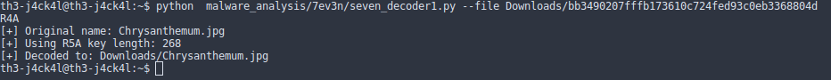
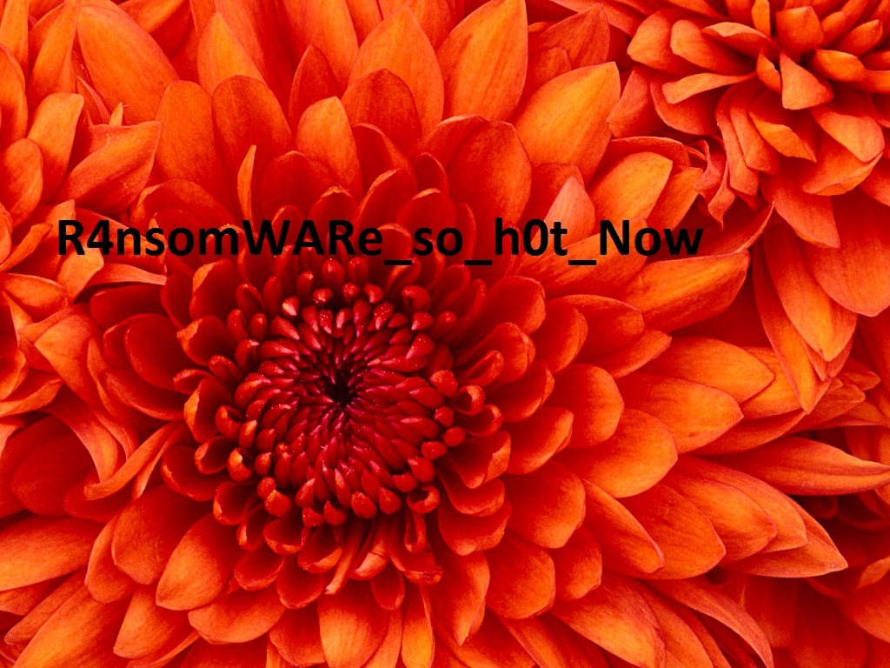

# Son parça - Forensic 500

```
İşte bellek işte fidye.

Ya atarsın ya çözersin.

Baktın olmaz vazgeçersin.

Zordur almak bizden kızı.

https://mega.nz/#!FxpnUTCK!EjpGWmTWRUnNmyRq1r2sO7RglpDqOUynhFX-VQFD0gU

```
([Dosya](./bb3490207fffb173610c724fed93c0eb3368804d))


Imaja dalmadan önce verilen eke bakalım dedik (`bb3490207fffb173610c724fed93c0eb3368804d`) fidye dedigi icin hemen ransomware decoderlara bakalim dedik [burasi](https://github.com/hasherezade/malware_analysis) tam aradigimiz yerdi. Tek tek tüm decoderları deniyelim dedik fakat şanslıydık ki [ilk](./seven_decoder1.py) denemede tuttu.  




`Chrysanthemum.jpg` adlı dosyayı açınca ise flagımız karşımızdaydı



yani flagimiz
```
DKHOS_{R4nsomWARe_so_h0t_Now}
```
