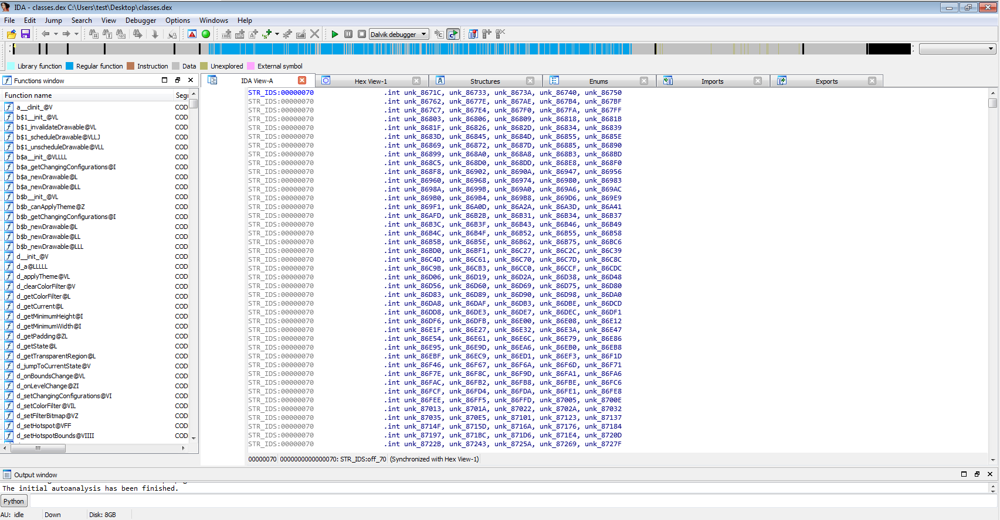
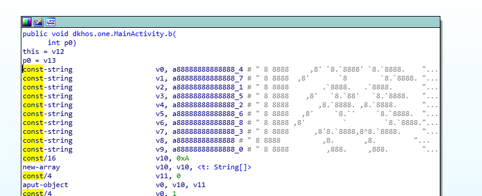
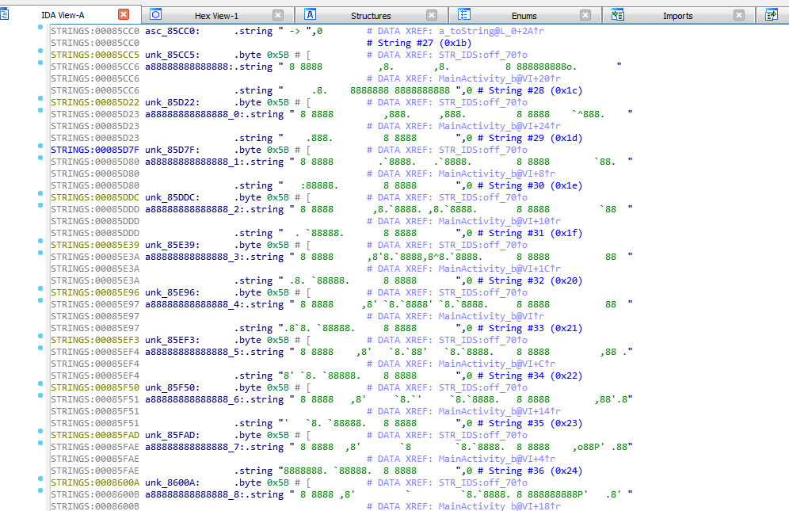

# Ayrılığın hediyesi - Mobile 100

```
Pelinsu'nun uzun zamandır kullandığı bir cep telefonunu en yakın arkadaşlarından biri Cansu'ya vermişti. Pelinsu'nun kaybolduğunu öğrenen Cansu ise telefonu hızlıca Mahmut'a ulaştırmış ve analiz etmesini istemişti. Yakın zamanda bir adresten gelen eposta içerisindeki bir .apk Mahmut'un dikkatini çekmişti. 
```

Verilen apkyi ([./20d0e07e19a3c91b8259afe0c591319e22af6cee.apk](20d0e07e19a3c91b8259afe0c591319e22af6cee.apk)) direk IDA'ya attik



Android uygulamalarda main class olan MainActivity'e gittik



String arrayi dikkatimizi cekti



``` assembly
STRINGS:00085CC6 a88888888888888:.string " 8 8888          ,8.       ,8.          8 888888888o.       "
STRINGS:00085CC6                                         # DATA XREF: MainActivity_b@VI+20↑r
STRINGS:00085CC6                 .string "     .8.    8888888 8888888888 ",0 # String #28 (0x1c)
STRINGS:00085D22 unk_85D22:      .byte 0x5B # [          # DATA XREF: STR_IDS:off_70↑o
STRINGS:00085D23 a88888888888888_0:.string " 8 8888         ,888.     ,888.         8 8888    `^888.    "
STRINGS:00085D23                                         # DATA XREF: MainActivity_b@VI+24↑r
STRINGS:00085D23                 .string "    .888.         8 8888       ",0 # String #29 (0x1d)
STRINGS:00085D7F byte_85D7F:     .byte 0x5B              # DATA XREF: STR_IDS:off_70↑o
STRINGS:00085D80 a88888888888888_1:.string " 8 8888        .`8888.   .`8888.        8 8888        `88.  "
STRINGS:00085D80                                         # DATA XREF: MainActivity_b@VI+8↑r
STRINGS:00085D80                 .string "   :88888.        8 8888       ",0 # String #30 (0x1e)
STRINGS:00085DDC unk_85DDC:      .byte 0x5B # [          # DATA XREF: STR_IDS:off_70↑o
STRINGS:00085DDD a88888888888888_2:.string " 8 8888       ,8.`8888. ,8.`8888.       8 8888         `88  "
STRINGS:00085DDD                                         # DATA XREF: MainActivity_b@VI+10↑r
STRINGS:00085DDD                 .string "  . `88888.       8 8888       ",0 # String #31 (0x1f)
STRINGS:00085E39 unk_85E39:      .byte 0x5B # [          # DATA XREF: STR_IDS:off_70↑o
STRINGS:00085E3A a88888888888888_3:.string " 8 8888      ,8'8.`8888,8^8.`8888.      8 8888          88  "
STRINGS:00085E3A                                         # DATA XREF: MainActivity_b@VI+1C↑r
STRINGS:00085E3A                 .string " .8. `88888.      8 8888       ",0 # String #32 (0x20)
STRINGS:00085E96 unk_85E96:      .byte 0x5B # [          # DATA XREF: STR_IDS:off_70↑o
STRINGS:00085E97 a88888888888888_4:.string " 8 8888     ,8' `8.`8888' `8.`8888.     8 8888          88  "
STRINGS:00085E97                                         # DATA XREF: MainActivity_b@VI↑r
STRINGS:00085E97                 .string ".8`8. `88888.     8 8888       ",0 # String #33 (0x21)
STRINGS:00085EF3 unk_85EF3:      .byte 0x5B # [          # DATA XREF: STR_IDS:off_70↑o
STRINGS:00085EF4 a88888888888888_5:.string " 8 8888    ,8'   `8.`88'   `8.`8888.    8 8888         ,88 ."
STRINGS:00085EF4                                         # DATA XREF: MainActivity_b@VI+C↑r
STRINGS:00085EF4                 .string "8' `8. `88888.    8 8888       ",0 # String #34 (0x22)
STRINGS:00085F50 unk_85F50:      .byte 0x5B # [          # DATA XREF: STR_IDS:off_70↑o
STRINGS:00085F51 a88888888888888_6:.string " 8 8888   ,8'     `8.`'     `8.`8888.   8 8888        ,88'.8"
STRINGS:00085F51                                         # DATA XREF: MainActivity_b@VI+14↑r
STRINGS:00085F51                 .string "'   `8. `88888.   8 8888       ",0 # String #35 (0x23)
STRINGS:00085FAD unk_85FAD:      .byte 0x5B # [          # DATA XREF: STR_IDS:off_70↑o
STRINGS:00085FAE a88888888888888_7:.string " 8 8888  ,8'       `8        `8.`8888.  8 8888    ,o88P' .88"
STRINGS:00085FAE                                         # DATA XREF: MainActivity_b@VI+4↑r
STRINGS:00085FAE                 .string "8888888. `88888.  8 8888       ",0 # String #36 (0x24)
STRINGS:0008600A unk_8600A:      .byte 0x5B # [          # DATA XREF: STR_IDS:off_70↑o
STRINGS:0008600B a88888888888888_8:.string " 8 8888 ,8'         `         `8.`8888. 8 888888888P'   .8' "
STRINGS:0008600B                                         # DATA XREF: MainActivity_b@VI+18↑r
STRINGS:0008600B                 .string "      `8. `88888. 8 8888       ",0 # String #37 (0x25)
```
Kaba duran bunu temizlemeye basladik

```
a88888888888888:.string " 8 8888          ,8.       ,8.          8 888888888o.       "
.string "     .8.    8888888 8888888888 ",0 # String #28 (0x1c)
a88888888888888_0:.string " 8 8888         ,888.     ,888.         8 8888    `^888.    "
.string "    .888.         8 8888       ",0 # String #29 (0x1d)
a88888888888888_1:.string " 8 8888        .`8888.   .`8888.        8 8888        `88.  "
.string "   :88888.        8 8888       ",0 # String #30 (0x1e)
a88888888888888_2:.string " 8 8888       ,8.`8888. ,8.`8888.       8 8888         `88  "
.string "  . `88888.       8 8888       ",0 # String #31 (0x1f)
a88888888888888_3:.string " 8 8888      ,8'8.`8888,8^8.`8888.      8 8888          88  "
string " .8. `88888.      8 8888       ",0 # String #32 (0x20)
a88888888888888_4:.string " 8 8888     ,8' `8.`8888' `8.`8888.     8 8888          88  "
 .string ".8`8. `88888.     8 8888       ",0 # String #33 (0x21)
a88888888888888_5:.string " 8 8888    ,8'   `8.`88'   `8.`8888.    8 8888         ,88 ."
.string "8' `8. `88888.    8 8888       ",0 # String #34 (0x22)
a88888888888888_6:.string " 8 8888   ,8'     `8.`'     `8.`8888.   8 8888        ,88'.8"
.string "'   `8. `88888.   8 8888       ",0 # String #35 (0x23)
a88888888888888_7:.string " 8 8888  ,8'       `8        `8.`8888.  8 8888    ,o88P' .88"
.string "8888888. `88888.  8 8888       ",0 # String #36 (0x24)
a88888888888888_8:.string " 8 8888 ,8'         `         `8.`8888. 8 888888888P'   .8' "
.string "      `8. `88888. 8 8888       ",0 # String #37 (0x25)

```

Sonra kumelemeye basladik her iki satiri tek satir halinde yazdik.

```
a88888888888888:.string " 8 8888          ,8.       ,8.          8 888888888o.       ".string "     .8.    8888888 8888888888 ",0 # String #28 (0x1c)
a88888888888888_0:.string " 8 8888         ,888.     ,888.         8 8888    `^888.    ".string "    .888.         8 8888       ",0 # String #29 (0x1d)
a88888888888888_1:.string " 8 8888        .`8888.   .`8888.        8 8888        `88.  ".string "   :88888.        8 8888       ",0 # String #30 (0x1e)
a88888888888888_2:.string " 8 8888       ,8.`8888. ,8.`8888.       8 8888         `88  ".string "  . `88888.       8 8888       ",0 # String #31 (0x1f)
a88888888888888_3:.string " 8 8888      ,8'8.`8888,8^8.`8888.      8 8888          88  "string " .8. `88888.      8 8888       ",0 # String #32 (0x20)
a88888888888888_4:.string " 8 8888     ,8' `8.`8888' `8.`8888.     8 8888          88  " .string ".8`8. `88888.     8 8888       ",0 # String #33 (0x21)
a88888888888888_5:.string " 8 8888    ,8'   `8.`88'   `8.`8888.    8 8888         ,88 .".string "8' `8. `88888.    8 8888       ",0 # String #34 (0x22)
a88888888888888_6:.string " 8 8888   ,8'     `8.`'     `8.`8888.   8 8888        ,88'.8".string "'   `8. `88888.   8 8888       ",0 # String #35 (0x23)
a88888888888888_7:.string " 8 8888  ,8'       `8        `8.`8888.  8 8888    ,o88P' .88".string "8888888. `88888.  8 8888       ",0 # String #36 (0x24)
a88888888888888_8:.string " 8 8888 ,8'         `         `8.`8888. 8 888888888P'   .8' ".string "      `8. `88888. 8 8888       ",0 # String #37 (0x25)
```
dahada temizleyince flag ortadaydi.

```
8 8888          ,8.       ,8.          8 888888888o.            .8.    8888888 8888888888
8 8888         ,888.     ,888.         8 8888    `^888.        .888.         8 8888       
8 8888        .`8888.   .`8888.        8 8888        `88.     :88888.        8 8888       
8 8888       ,8.`8888. ,8.`8888.       8 8888         `88    . `88888.       8 8888       
8 8888      ,8'8.`8888,8^8.`8888.      8 8888          88   .8. `88888.      8 8888       
8 8888     ,8' `8.`8888' `8.`8888.     8 8888          88  .8`8. `88888.     8 8888       
8 8888    ,8'   `8.`88'   `8.`8888.    8 8888         ,88 .8' `8. `88888.    8 8888       
8 8888   ,8'     `8.`'     `8.`8888.   8 8888        ,88'.8'   `8. `88888.   8 8888       
8 8888  ,8'       `8        `8.`8888.  8 8888    ,o88P' .888888888. `88888.  8 8888       
8 8888 ,8'         `         `8.`8888. 8 888888888P'   .8'       `8. `88888. 8 8888       

```
yani flagimiz
```
DKHOS_{IMDAT}
```
