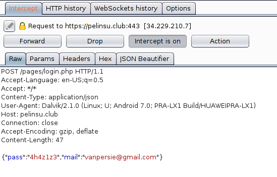
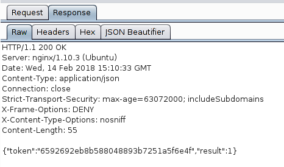
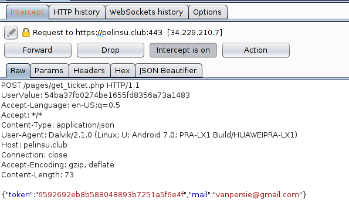
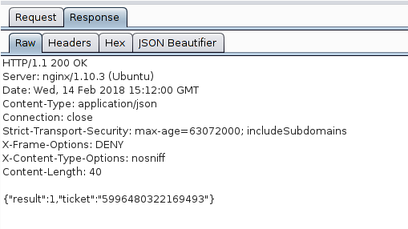
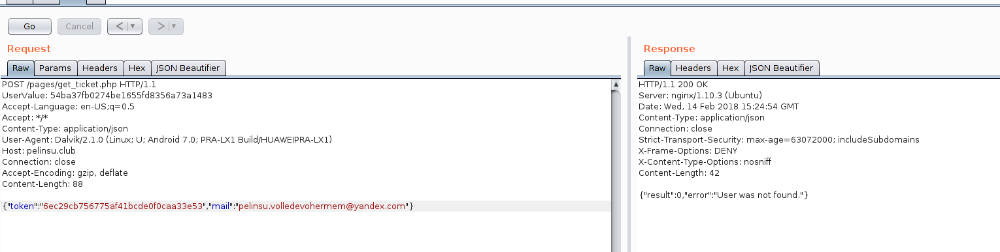
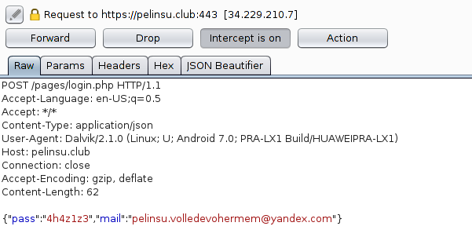
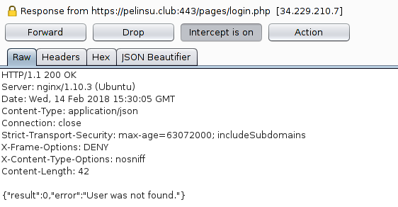
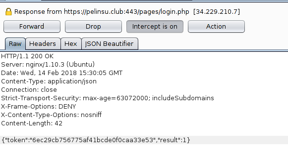
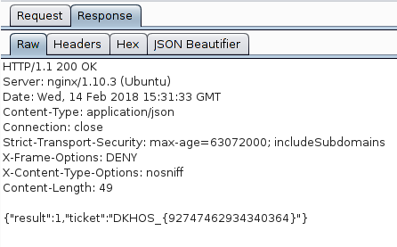

# Zabaha kadar dans - Mobile 300


```
Pelinsu Hollanda'da bir club'a giriş için önceden biletini almış. Bilet numarası belki Mahmut için faydalı bir bilgi olabilir.

Mahmut'un araştırmasına göre Pelinsu'nun çocukluk arkadaşı Robin Van Persie de bu etkinliğe gidecekmiş.

Mahmut Vanpersie'nin e-mail ve parolasını biliyordu zaten:

vanpersie@gmail.com:4h4z1z3
Pelinsu'nun eski cep telefonundan çıkan uygulama ile bilet numarasına ulaşmayı denemeliydi...
```


Verilen apkyi ([./67030efaef10bdc75550420dfd09825747bfd60d.apk](67030efaef10bdc75550420dfd09825747bfd60d.apk))kurduk,  Burp'u açıp login olmayı denedik




diye bir request attı, response ise;



hash ( `6592692eb8b588048893b7251a5f6e4f` ) MD5 ve `whitebox` anlamina geliyordu.

responsedan hemen sonra bir request daha atip bilet numarasini aliyordu





 Zaten maili Web100 sorsunda ogrenmistik (`pelinsu.volledevohermem@yandex.com`) tek sorun tokeni manupile etmekti. Hemen ise koyulduk, en basta 2ci requesti degistirip ugrasiyordum fakat olmuyordu sonra beynimdeki ampul yandi ve token olarak `blackbox`'un MD5 halini koysak ne olur



Fakat olmamisti sorun neydi?
HTTP headerlerinde ilginc bir header vardi. Bu header disardan gelmiyordu yani program isleyerek onu cikariyordu. O zaman hatali response vererek bu tagi manupile edebiliriz dedik
```
UserValue: 54ba37fb0274be1655fd8356a73a1483
```




Response'i modifiye ettik




ve Flag karsimiza geldi



yani;
```
DKHOS_{92747462934340364}
```
