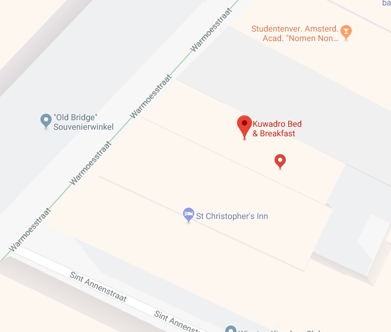

# Zazdarovje - OSINT 100


```
Çorumlu Karacemal'in mesajına ulaşan Mahmut artık ipucuna çok yaklaşmıştı....

Ç.K.: HAHAHAH... onunla bir daha asla iletişime geçmeyeceğim olurda bir şekilde bu yazışmaya ulaşırsa, gitmesi gereken yer (52.37396088582039,4.896380603313446) burasıdır. Sezar'ın hakkını Sezar'a verirse belkide herşey senin istediğin gibi olur...Unutmadan, eğer oraya ulaşabilirse üç kere etrafta tur atmadan gelmesinler.

```

Aslinda soru böyle değildi.

`Pelinsu facebook hesabını kapattı alternativ arkadaşlık sitelerine yöneldi.` idi. Bizde `Zazdarovje` rusçadır diyip `vk.com`'a yöneldik. `Pelinsu Volle de Vohermem` adlı profile bakındık bir postunda `base64` şekilde `Aaah aaah, keşke Çorumlu Karacemal burada olsaydı` yazıyordu. Karacemali `pastebin` arattık ve karşımıza  https://pastebin.com/dycg87Sk çıktı

Sorudaki videoda 3D pavement art orneği bulunmaktaydı.Eserin Leon Keer'e ait oldugunu ve TU Delft isimli universitede yapildigini öğrendik. Google streetview da alakali yeri gezdik verilen kordinata gittik (`52.37396088582039,4.896380603313446`)  `Kuwadro` diye bir yeri işaret ediyordu.



`Sezar'ın hakkını Sezar'a verirse belkide herşey senin istediğin gibi olur...` dediği için 3 defa `ROT13` uyguladik.


ve flag
```
DKHOS_{xhjnqeb}
```
#### Çözen Grup Arkadaşımızın Reklamı : https://www.d1scharg3d.me
