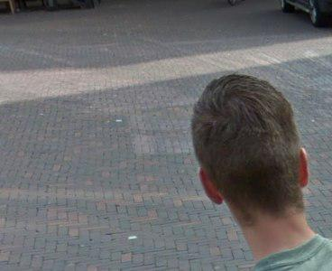
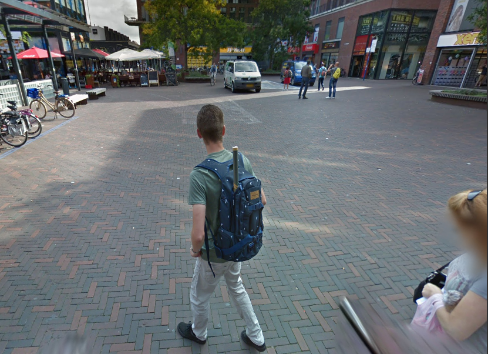

# Sokaklarda ne ararsın beni kimden sorarsın - Mobile 200


[VIDEO](814c07fd840d64357978548215168ebbaedf0150.mp4)
```
Mahmut ulaştığı kayıtları incelediğinde Pelinsu'nun lokasyonunun çocuğun çantasında gizli olduğunu düşünmekteydi.

```


Sorudaki videoda 3D pavement art orneği bulunmaktaydı.Eserin Leon Keer'e ait oldugunu ve TU Delft isimli universitede yapildigini öğrendik. Google streetview da alakali yeri gezdik ve adresin
```
Bastiaansplein 1
2611 DC Delft
```



Sorudaki arkadasi bulup çantasının markasını `DAKINE` flag olarak deniyoruz ve flag
```
DKHOS_{DAKINE}
```
#### Çözen Grup Arkadaşımızın Reklamı : https://www.d1scharg3d.me
