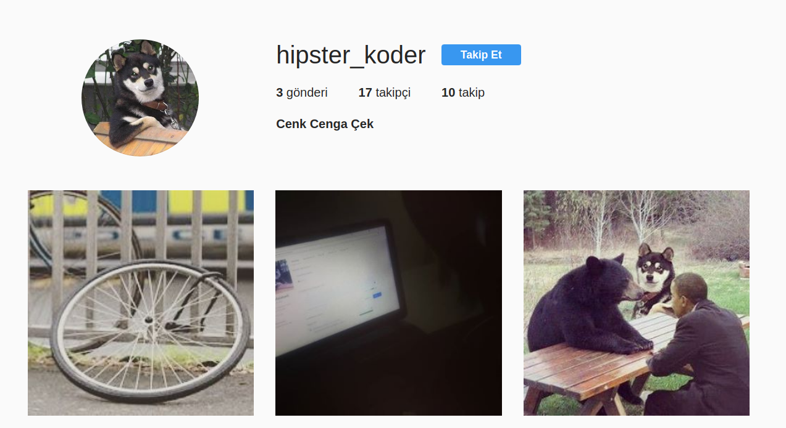
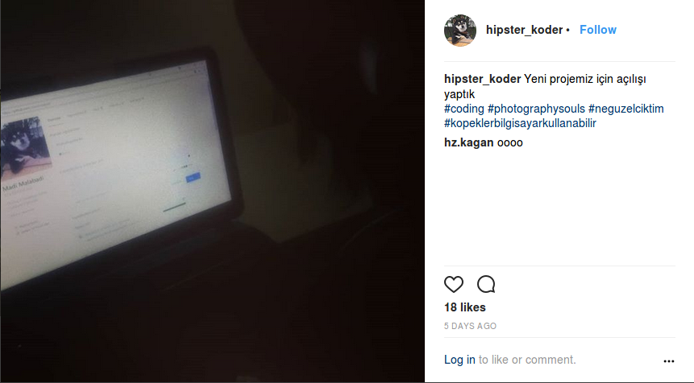
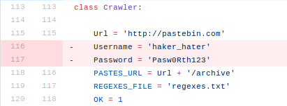
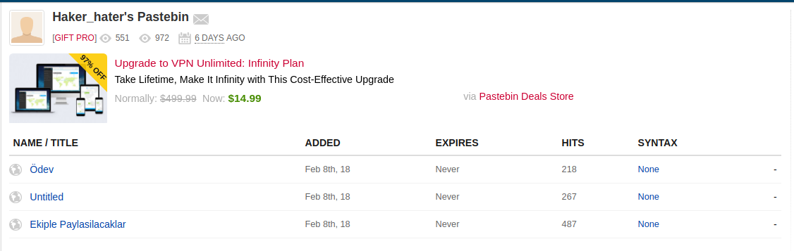
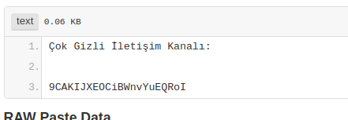
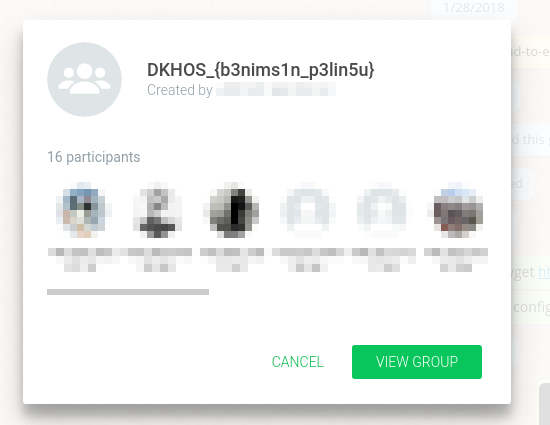

# Naber  - OSINT 300

```
Pelinsu zamanında en yakın arkadaşı hipster_koder ile görüşmekteydi. Mahmut hipster_koder'ın Pelinsu'ya platonik aşık olduğunu bilmekteydi. Her ihtimalde Pelinsu hakkında yeni bilgilere ulaşmak için araştırması gerekecekti.
```

`hipster_koder` kullanici adini internetten arayinca instagram hesabi oldugunu goruyoruz



Instagram profilinde paylasimlarinin birinde yaptigi projeden bahsetmis. Görselde `Madi Malabadi` adlı bir github hesabının fotoğrafı var



Hesabına gittiğimizde bir tane reposu olduğunu görüyoruz ve hemen commitlerine göz atınca `gozumuzden biseyler kacmis xD` diye bir commit görüyoruz



Hemen pastebinden kullanıcı profiline gidiyoruz `http://pastebin.com/u/haker_hater`



"Ekiple Paylasılacaklar" adlı pasteye bakıyoruz  


```
9CAKIJXEOCiBWnvYuEQRoI
```
Ilginç bir kod bizi karşılıyor ve sorunun adı olan `Naber ?` ile bağlıntı kurup `What's up?` diyip Whatsapp grup daveti olarak giriyoruz  




yani flag ;

```
DKHOS_{b3nims1n_p3lin5u}
```

#### Çözen Grup Arkadaşımızın Reklamı : https://www.d1scharg3d.me
