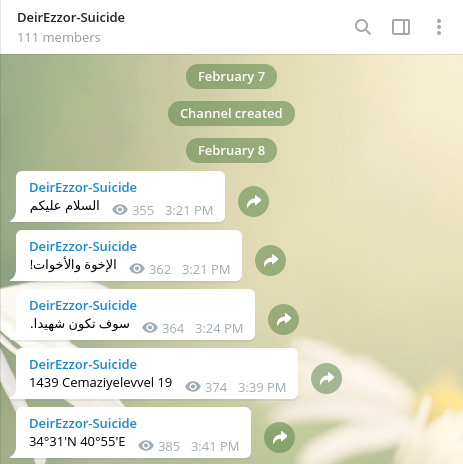
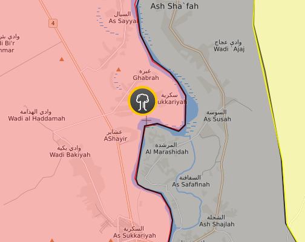
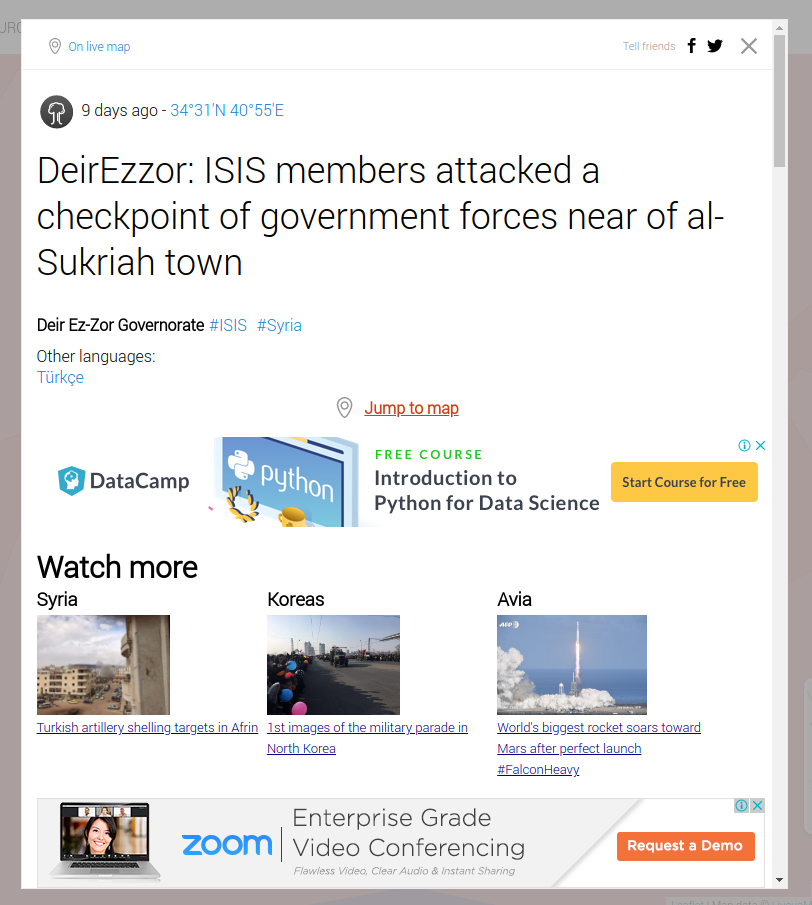
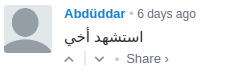
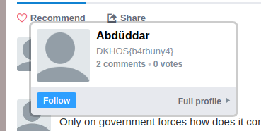

# Sokaklarda ne ararsın beni kimden sorarsın - Mobile 200

```
Pelinsu acaba Hollanda'dan kalkıp savaş bölgesine doğru gitmiş olabilir miydi ? Buraları iyi bilen birilerini araştırmak gerekecek ...

joinchat/AAAAAESbwxmZjRyggLlfqA

```

Chat linkini gördüğümüzde bunun telegram grup chat linki olduğunu anladık ve  gruba girdik



İlk üç mesajda arapça cümleler vardı. 4. mesaj hicri bir tarih ve 5. mesajda lokasyon bilgisi verilmişti

İlk üç mesajın çevirisi ( tam dogru bir ceviri olmayabilir cok da muhim degil) :
```
Selamun Aleykum
Kardeşler!
Sen şehit olacaksın. (
```
http://syria.liveuamap.com 'e girip o tarihte ve o lokasyona baktik


`DeirEzzor: ISIS members attacked a checkpoint of government forces near of al-Sukriah town`



Yorumları inceleyince benim abim şehit edildi diye yorum atan birine denk geliyoruz



Profiline bakinca ise flagi goruyoruz



yani flag ;

```
DKHOS{b4rbuny4}
```
#### Çözen Grup Arkadaşımızın Reklamı : https://www.d1scharg3d.me
