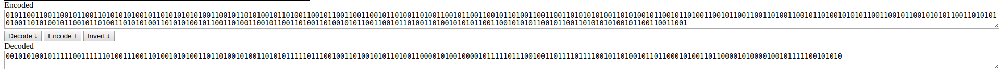

# Tamirci Pala Remzi - Reversing 100


```

Pelinsu'nun eski ipad'ini uzun uğraşlar sonucunda telefon tamircisinden geri alan mahmut cihazı yeniden başlatır.

Ekran açılır. Youtube'dan video oynamaya başlar. https://www.youtube.com/watch?v=o_TKIM1vUEs

Acaba Pelinsu burada olabilir mi ? diye düşünür Mahmuıt.

Video sonunda bir anda Mahmut'un önünden sayılar akıp gitmeye başlar.


0101100110011001011001101010101001011010101010100110010110101001011010011001011001100110010110100110100110010110011001011010011001100110101010100110101001011001011010011001011001100110100110010110100101010110011001011001010101100110101010100110101001011001011010011010101001101010100101100110100110010110011010011010010101100110010110100110100101010110011001010101100101100110101010100101100110011001


```


Videoda olan tek şey Manchester'di. Ve sorudan gelenbir takim binary code. En basta hexe cevirip amele gibi bilgi cikarmaya calişsamda. Sonra soruyu okuma karari aldim ve http://bfy.tw/GbB4

Karsima cikan link ise direk decoderi idi
http://eleif.net/manchester.html




binary2ascii yapincada


```
*_?NiSiM_riZaH_royilSaB_*.

```

revert edince

```
.*_BaSliyor_HaZir_MiSiN?_*
```
