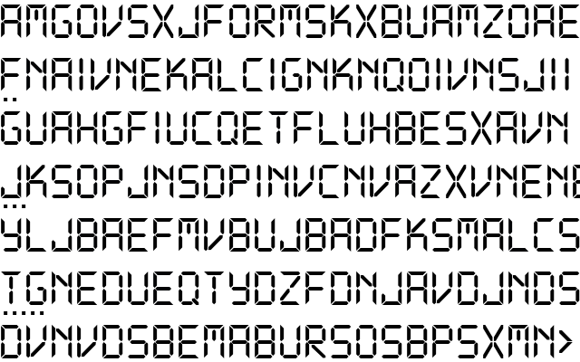
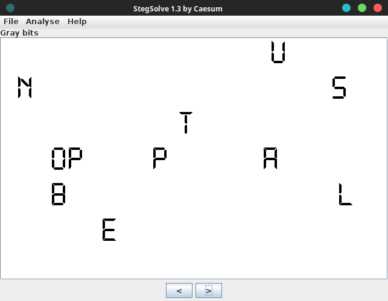

# Geçmişe Yolculuk - Trvia 200



```
Camın üzeri buğuluydu. Şimdilik resmini çekerim, sonra daha detaylı incelerim diye düşünmüştü Mahmut. Pelinsu'nun izlerini geçmişte de birileri aynı yöntemlerle araştırmış olabilir miydi.
```
Resimli sorularda yapilacak ilk is genelde exifine baktiktan sonra renkleri ile oynamaktir. Exifinde birsey yoktu, renklerine baktik. bizde



Flagimiz yani;
```
DKHOS_{UNSTOPPABLE}
```
