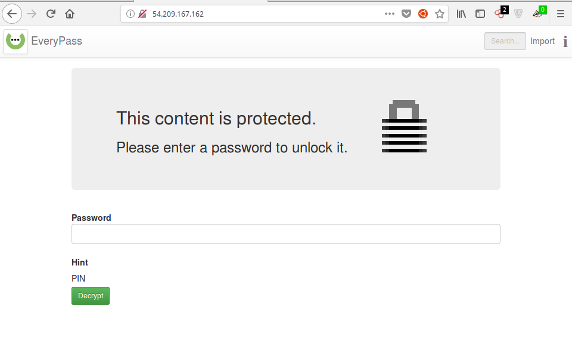
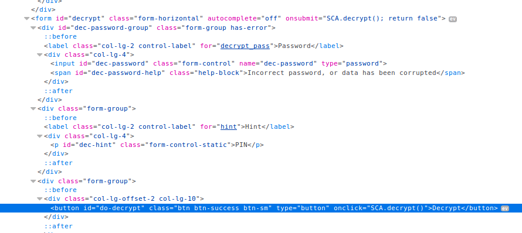
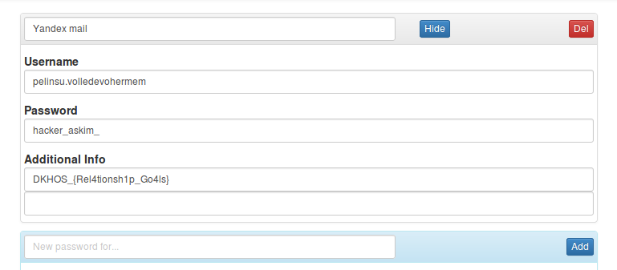

# Yamtar - Web 100


```
http://54.209.167.162
```


Hemen rastgele bir pin denemesi yaptik ve aninda cevap aldim bu yüzden direk kaynak koduna baktık.



Kod pin uyusuyor ise bizi login yapiyordu. O zaman bruteforce yapacaktik. DOM kasmasin diye 1000-1000 ayirip yapacaktik.


``` javascript
for(i=1000;i<2000;i++){
document.getElementById("dec-password").value = i;
SCA.decrypt();
}

```


ve `1917` de login yaptigini goruyoruz
Yani flagimiz;

 ```
DKHOS_{Rel4tionsh1p_Go4ls}
 ```
